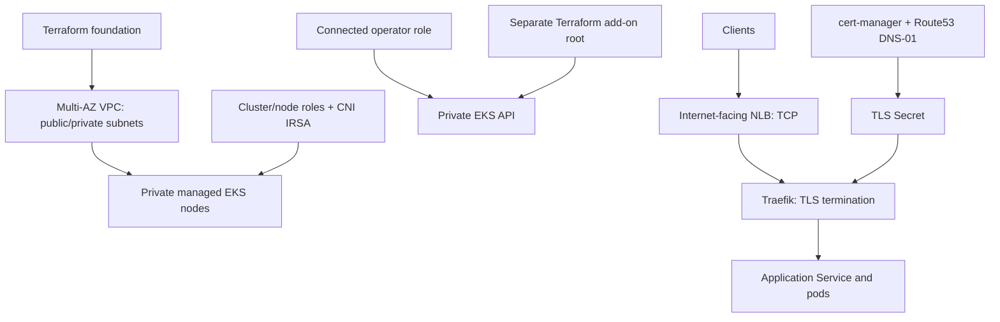

# Modular AWS EKS Platform with Terraform, Ingress & cert-manager

## Overview

Production-oriented portfolio implementation with separate cloud-foundation and Kubernetes-add-on state. **Code implemented; AWS deployment not verified.** No uptime, scale, or recovery results are claimed. See [validation evidence](docs/validation.md).

## Architecture

Five local modules own VPC, IAM, security, EKS, and add-ons. Workers are private; the EKS API is private. The operator must use a connected network. This is an AWS commercial-partition, IPv4 baseline.

## Architecture Diagram



## Engineering Goals

Reproducible infrastructure, explicit environment state, private workers, scoped identities, reviewed plans, verified TLS, and documented recovery. Operational acceptance remains pending account-backed exercises.

## Technology Stack

AWS VPC/EKS/IAM/S3/CloudWatch/Route53, Terraform 1.14.6 for validation, AWS provider 6.x, Helm provider 3.x, AWS Load Balancer Controller, Traefik and cert-manager.

## Repository Structure

```text
bootstrap/state/                  Protected S3 state bucket
modules/{vpc,iam,security,eks,addons}/
environments/{dev,staging,production}/{foundation,addons}/
platform/issuer.yaml.example      ACME staging issuer
.github/workflows/validate.yml    Credential-free validation
docs/                            Decisions, validation and operations
```

## Prerequisites

AWS CLI v2, authorized AWS identity, Terraform >=1.10, kubectl compatible with the chosen cluster, a Route53 zone, an operator IAM role, and network connectivity to the private API. Select mutually compatible EKS/add-on/chart versions before planning.

Copy each root's `*.example` files and replace placeholders. The examples deliberately cannot deploy an unspecified AWS environment.

## Infrastructure Components

- Public subnets host NAT gateways and the NLB; nodes receive no public IPs.
- Development uses one NAT by example; staging/production examples use a NAT per AZ.
- EKS uses managed nodes with a two-node baseline and maximum four nodes. No node autoscaler is installed.
- The CNI uses its own IRSA role; node IAM does not carry CNI permissions.
- All EKS control-plane log types are enabled with 14-day retention.
- S3 bootstrap enables encryption, versioning, public-access blocking and TLS-only requests, with deletion protection.
- S3 lockfiles are enabled per state root. Protect the local bootstrap state and back it up separately.

## Security Architecture

The private API accepts HTTPS from configured connected CIDRs and cluster networking. The explicit operator role has cluster administrator access for bootstrap; it is not an application identity. Restrict who can assume it.

Controller roles bind exact OIDC audience and service-account subjects. cert-manager can modify the specified hosted zone. The vendored load-balancer policy comes from controller v2.14.1; select the matching chart/controller or update and review that policy together. It contains AWS-required discovery wildcards and tag-scoped controller operations.

State and saved plans can contain sensitive values. Do not commit them. CI validates without AWS credentials and does not run apply. Add narrowly scoped OIDC plan/apply roles only after the target account is known.

## Deployment Workflow

Bootstrap state → configure foundation → validate → review saved plan → apply → configure add-ons → review saved plan → apply → configure DNS/issuer → validate workloads. Terraform owns Helm platform releases; Argo CD owns application resources.

## Configuration

Foundation inputs cover region, environment, CIDR, AZs, NAT strategy, operator CIDRs/role, Kubernetes version, node types and EKS add-on versions. Add-on inputs include foundation outputs, hosted-zone ID and pinned chart versions.

Use different state keys for every root. Production should use a separate AWS account/role; directory names alone do not isolate accounts. No AWS account is preconfigured.

## Installation / Deployment

From the repository root, after configuring authorized credentials:

```bash
aws sts get-caller-identity
terraform -chdir=bootstrap/state init
terraform -chdir=bootstrap/state plan -var='aws_region=ap-south-1' -var='bucket_name=<unique-state-bucket>' -out=state.tfplan
terraform -chdir=bootstrap/state show state.tfplan
# Review before applying; protect bootstrap local state.
terraform -chdir=bootstrap/state apply state.tfplan

cp environments/dev/foundation/backend.hcl.example environments/dev/foundation/backend.hcl
cp environments/dev/foundation/terraform.tfvars.example environments/dev/foundation/terraform.tfvars
# Replace placeholders and review the account, CIDRs and versions.
terraform -chdir=environments/dev/foundation init -backend-config=backend.hcl
terraform -chdir=environments/dev/foundation validate
terraform -chdir=environments/dev/foundation plan -out=foundation.tfplan
terraform -chdir=environments/dev/foundation show foundation.tfplan
terraform -chdir=environments/dev/foundation apply foundation.tfplan
terraform -chdir=environments/dev/foundation output
```

Use the foundation outputs in the add-on root's copied variable file. From the connected operator network:

```bash
aws eks update-kubeconfig --region ap-south-1 --name nafees-dev
kubectl get nodes
terraform -chdir=environments/dev/addons init -backend-config=backend.hcl
terraform -chdir=environments/dev/addons plan -out=addons.tfplan
terraform -chdir=environments/dev/addons show addons.tfplan
terraform -chdir=environments/dev/addons apply addons.tfplan
```

Configure and apply `platform/issuer.yaml.example` after replacing its values. Route application DNS to the Traefik NLB. ACME staging certificates are intentionally not publicly trusted; use a production issuer only after validating DNS-01 and renewal.

## Validation

```bash
terraform fmt -check -recursive
terraform -chdir=environments/dev/foundation init -backend=false
terraform -chdir=environments/dev/foundation validate
terraform -chdir=environments/dev/addons init -backend=false
terraform -chdir=environments/dev/addons validate
```

After deployment, verify node readiness, private addressing, forbidden access, ingress routing, certificate renewal, and failed-rollout recovery. Inspect `kubectl get certificates -A` and `kubectl get pods -A`. Record real results before claiming readiness.

## Observability

Control-plane logs are implemented. Prometheus, Grafana, workload log forwarding and alert destinations are future integrations. No dashboard or alert coverage is implied.

## Failure / Rollback Strategy

Inspect actual state after a failed apply and generate a fresh plan. Revert compatible add-on versions through Terraform configuration. EKS control-plane downgrades are not a rollback mechanism. Restore state versions only after coordinating with all operators. Preserve application data before cluster replacement.

## Destroy / Cleanup

Remove application Ingress/LoadBalancer resources while their controllers still run, verify AWS load balancer deletion, then destroy add-ons before foundation:

```bash
terraform -chdir=environments/dev/addons plan -destroy -out=destroy.tfplan
terraform -chdir=environments/dev/addons show destroy.tfplan
terraform -chdir=environments/dev/addons apply destroy.tfplan
terraform -chdir=environments/dev/foundation plan -destroy -out=destroy.tfplan
terraform -chdir=environments/dev/foundation show destroy.tfplan
terraform -chdir=environments/dev/foundation apply destroy.tfplan
```

Check retained disks, snapshots, DNS, log groups, public IPs and load balancers. State storage has intentional deletion protection and is not part of routine teardown.

## Cost Considerations

EKS control plane, two or more worker instances, EBS, NAT hours/data processing, NLB, public IPv4 addresses, logs and transfer incur costs. A cost estimate requires selected region, versions, running hours and traffic. No cloud apply has been performed by this repository setup.

## Known Limitations

No account-backed provisioning, TLS renewal, scale or recovery evidence yet. The baseline has no node autoscaler, VPC flow logs, EBS CSI driver, workload secret manager, NetworkPolicy enforcement, regional DR or application backups. Version placeholders must be resolved against the target region before planning.

## Future Improvements

Complete sandbox acceptance, add VPC flow logs and operational dashboards, enforce workload network policy, configure short-lived deployment roles, test capacity and recovery, and document supported upgrade paths.
